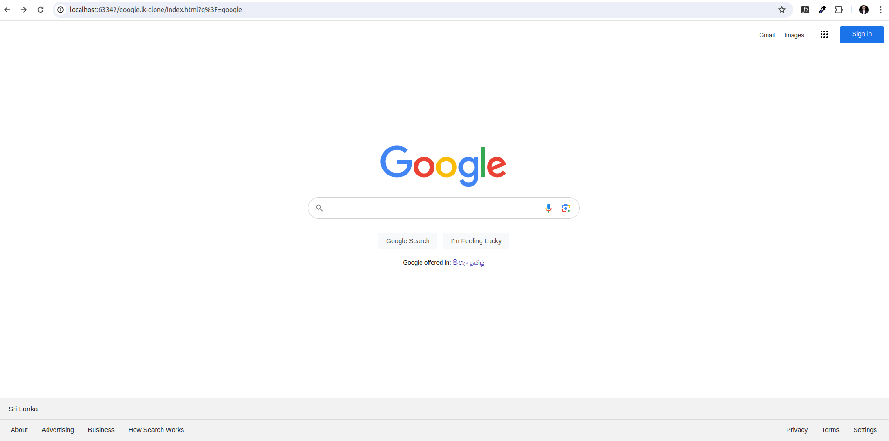
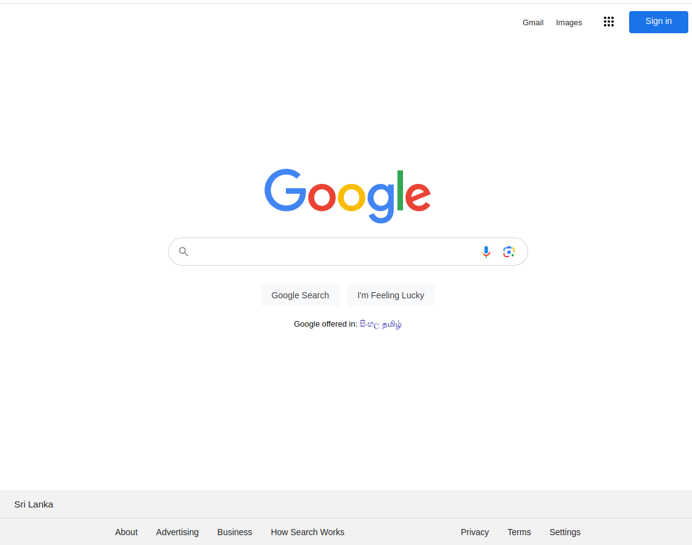
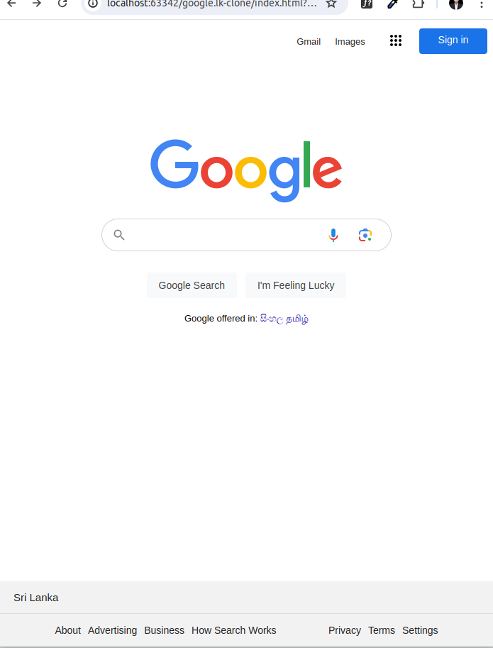
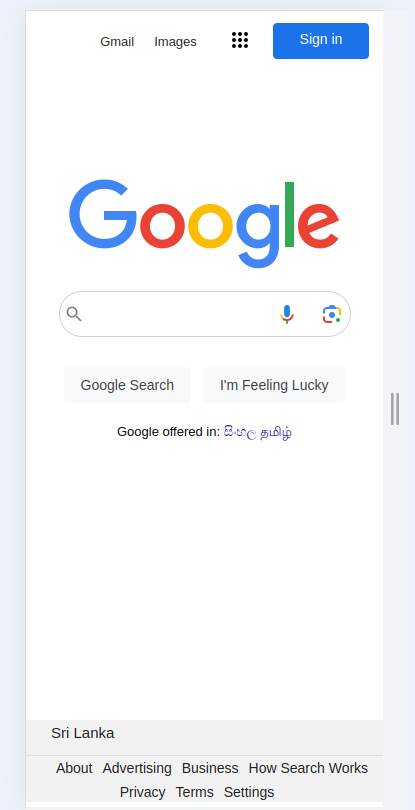

<!-- PROJECT LOGO -->
 

  <a href="https://github.com/MyPlaygroundDEP/google-clone-test-host">

[//]: # (    )
  </a>

<h3 align="center">Google Clone UI with Native HTML & CSS</h3>

  

    This is a clone of google ui which was built only for educational purposes.
     
   

<!-- ABOUT THE PROJECT -->

## About The Project

This project is a replica of the Google user interface, aiming to mimic the look and feel of the original Google search
page. It includes the search bar, buttons, and other elements found on the Google homepage.
**This is designed for totally educational purposes only** 

### Built With

+ HTML
+ CSS

### Features
 + Responsive design to ensure compatibility across various devices and screen sizes.
 + Mimics Google's search functionality
 + Provides a visually similar experience to the original Google homepage.
<!-- USAGE EXAMPLES -->

### Usage

+ Responsive design

+ Max width 1200px
  

+ Max width 992px
  
+ Small -screen widths
  
  

<!-- LICENSE -->

## License

Distributed under the MIT License. See `LICENSE.txt` for more information.

(<a href="#readme-top">back to top</a>)

